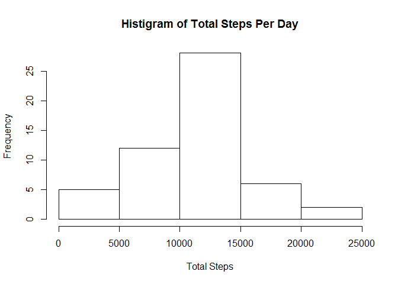
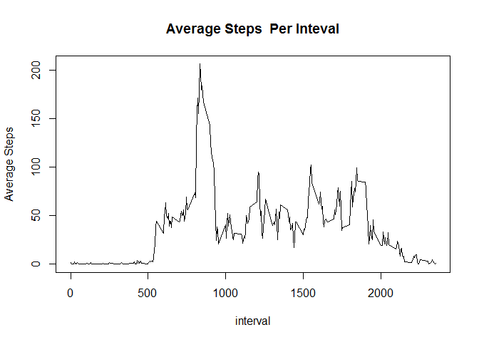
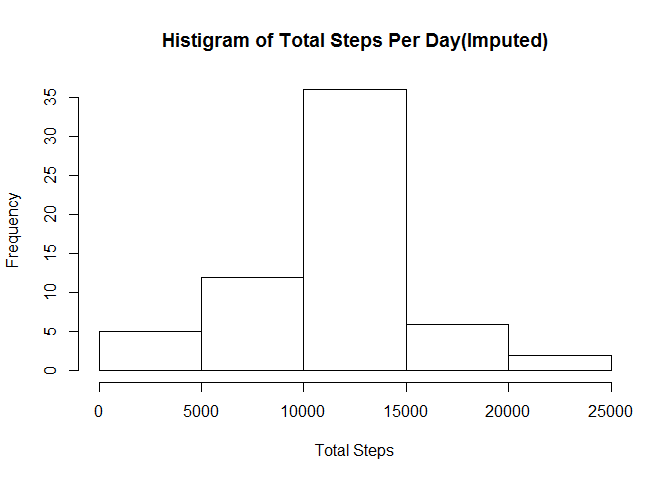
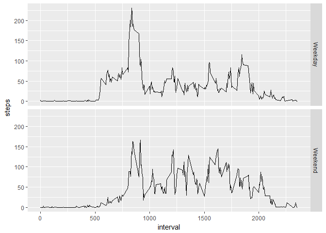

# Reproducible Research: Peer Assessment 1

```r
library(dplyr)
```

```
## 
## Attaching package: 'dplyr'
```

```
## The following objects are masked from 'package:stats':
## 
##     filter, lag
```

```
## The following objects are masked from 'package:base':
## 
##     intersect, setdiff, setequal, union
```

```r
library(lubridate)
```

```
## 
## Attaching package: 'lubridate'
```

```
## The following object is masked from 'package:base':
## 
##     date
```

```r
library(ggplot2)
```

## Loading and preprocessing the data
Show any code that is needed to
1. Load the data (i.e. read.csv())
2. Process/transform the data (if necessary) into a format suitable for your
analysis

```r
# unzip("activity.zip")
raw_data <- as.tbl(read.csv("activity.csv"))
my_data <- raw_data %>% filter(!is.na(steps)) %>% mutate(date = as.Date(date))
summary(my_data)
```

```
##      steps             date               interval     
##  Min.   :  0.00   Min.   :2012-10-02   Min.   :   0.0  
##  1st Qu.:  0.00   1st Qu.:2012-10-16   1st Qu.: 588.8  
##  Median :  0.00   Median :2012-10-29   Median :1177.5  
##  Mean   : 37.38   Mean   :2012-10-30   Mean   :1177.5  
##  3rd Qu.: 12.00   3rd Qu.:2012-11-16   3rd Qu.:1766.2  
##  Max.   :806.00   Max.   :2012-11-29   Max.   :2355.0
```

## What is mean total number of steps taken per day?
For this part of the assignment, you can ignore the missing values in the dataset.
1. Make a histogram of the total number of steps taken each day
2. Calculate and report the mean and median total number of steps taken
per day

```r
data1 <- my_data %>% group_by(date) %>% summarize(sum=sum(steps))
hist(data1$sum, main = "Histigram of Total Steps Per Day", xlab = "Total Steps")
```

<!-- -->

```r
sprintf("Mean number of steps take per day %3.0f",mean(data1$sum))
```

```
## [1] "Mean number of steps take per day 10766"
```

```r
sprintf("Median number of steps take per day %3.0f", median(data1$sum))
```

```
## [1] "Median number of steps take per day 10765"
```


## What is the average daily activity pattern?
1. Make a time series plot (i.e. type = "l") of the 5-minute interval (x-axis)
and the average number of steps taken, averaged across all days (y-axis)
2. Which 5-minute interval, on average across all the days in the dataset,
contains the maximum number of steps?

```r
data2 <- my_data %>% group_by(interval) %>% summarise(mean=mean(steps))
plot(data2,type='l', main = "Average Steps  Per Inteval", ylab = "Average Steps")
```

<!-- -->


## Imputing missing values
Note that there are a number of days/intervals where there are missing values
(coded as NA). The presence of missing days may introduce bias into some
calculations or summaries of the data.
1. Calculate and report the total number of missing values in the dataset
(i.e. the total number of rows with NAs)

```r
sum(is.na(raw_data$steps))
```

```
## [1] 2304
```
2. Devise a strategy for filling in all of the missing values in the dataset. The
strategy does not need to be sophisticated. For example, you could use
the mean/median for that day, or the mean for that 5-minute interval, etc.

3. Create a new dataset that is equal to the original dataset but with the
missing data filled in.

```r
for(i in seq_along(raw_data$steps)){if(is.na(raw_data[i,"steps"])){raw_data[i,"steps"] <- data2[data2[,"interval"]==as.numeric(raw_data[i,"interval"]),"mean"] }}
```
4. Make a histogram of the total number of steps taken each day and Calculate
and report the mean and median total number of steps taken per day. Do
these values differ from the estimates from the first part of the assignment?
What is the impact of imputing missing data on the estimates of the total
daily number of steps?

```r
data3 <- raw_data %>% group_by(date) %>% summarize(sum=sum(steps))
hist(data3$sum, main = "Histigram of Total Steps Per Day(Imputed)", xlab = "Total Steps")
```

<!-- -->

```r
sprintf("Mean number of steps take per day %03f", mean(data3$sum))
```

```
## [1] "Mean number of steps take per day 10766.188679"
```

```r
sprintf("Median number of steps take per day %03f",median(data3$sum))
```

```
## [1] "Median number of steps take per day 10766.188679"
```


## Are there differences in activity patterns between weekdays and weekends?

```r
raw_data <- raw_data %>% mutate(wkday=ifelse(weekdays(as.Date(date)) %in% c("Saturday", "Sunday"), "Weekend", "Weekday")) 
xx <- aggregate(steps ~ interval + wkday, raw_data, mean)
p1 <- ggplot(xx, aes(x=interval, y=steps)) +geom_line() +facet_grid(wkday ~ .)
print(p1)
```

<!-- -->
